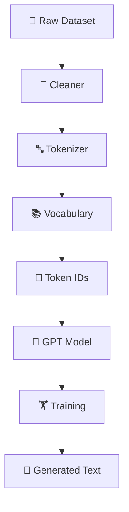
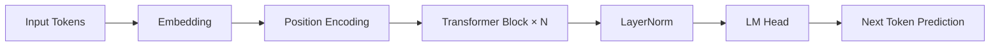

<div align="center">

---

# 📑 Table of Contents

- 🚀 Features
- ⚡ Quick Start
- 🏗️ Architecture
- 📂 Project Structure
- 📚 Tokenizer
- 📦 Dataset Pipeline
- 🤖 GPT Model
- 🏋️ Training
- 🔍 Inference
- 🧪 Testing
- 📊 Progress
- 🗺️ Roadmap
- 🤝 Contributing
- 📜 License

---

# ✨ Features

- ✅ GPT-style Decoder Architecture
- ✅ Built Completely From Scratch
- ✅ Word, Character & Byte-Level BPE Tokenizers
- ✅ Custom Vocabulary Builder
- ✅ Dataset Pipeline
- ✅ Multi-Head Self Attention
- ✅ Causal Masking
- ✅ Transformer Blocks
- ✅ GPT-2 Style Weight Initialization
- ✅ Weight Tying
- ✅ GPU Training Support
- ✅ Text Generation
- ✅ Interactive Chat
- ✅ Modular Codebase
- ✅ Unit Tests

---

# ⚡ Quick Start

```bash
pip install -r requirements.txt
python scripts/prepare_data.py
python train.py --data data/tinystories.txt --tokenizer bpe
python chat.py --checkpoint checkpoints_ts/best.pt
```

---

# 🏗️ Architecture



---

# 🤖 GPT Pipeline



---

# 📂 Project Structure

```text
AIRA-LLM/
├── configs/
├── data/
├── dataset/
├── tokenizer/
├── model/
├── training/
├── inference/
├── tests/
├── utils/
├── scripts/
├── train.py
├── chat.py
├── chat_ai.py
└── README.md
```

---

# 📚 Tokenizer

| Tokenizer         | Description          |
| ----------------- | -------------------- |
| 🔤 Word           | Word-level tokenizer |
| 🔡 Character      | Character tokenizer  |
| 🧩 Byte-Level BPE | No`<UNK>` token    |

Reserved Tokens:

| Token      | ID |
| ---------- | -: |
| `<PAD>`  |  0 |
| `<UNK>`  |  1 |
| `<BOS>`  |  2 |
| `<EOS>`  |  3 |
| `<MASK>` |  4 |

---

# 📦 Dataset Pipeline

```text
Raw Text
   │
   ▼
Cleaner
   │
   ▼
Tokenizer
   │
   ▼
Vocabulary
   │
   ▼
Token IDs
   │
   ▼
Training Sequences
```

---

# 🧠 GPT Model

- Token Embedding
- Positional Encoding
- Multi-Head Self Attention
- Feed Forward Network
- Layer Normalization
- Transformer Blocks
- Language Modeling Head

---

# 🏋️ Training

- Cross Entropy Loss
- AdamW Optimizer
- Learning Rate Scheduler
- Gradient Clipping
- Checkpointing
- Validation
- GPU Training

---

# 🔍 Inference

- Greedy Decoding
- Temperature Sampling
- Top-k Sampling
- Top-p Sampling
- Beam Search

---

# 🧪 Testing

Run all tests:

```bash
pytest tests -q
```

---

# 📊 Project Status

| Module             | Status |
| ------------------ | ------ |
| 🧠 Model           | ✅     |
| 🔤 Tokenizer       | ✅     |
| 📦 Dataset         | ✅     |
| 🏋️ Training      | ✅     |
| 💬 Chat            | ✅     |
| ⚡ Flash Attention | 🚧     |
| 🌀 RoPE            | 🚧     |
| 📡 API             | 📅     |

---

# 🗺️ Roadmap

## ✅ v0.1

- Core GPT Prototype
- Dataset Pipeline

## ✅ v0.2

- GPT-style Architecture
- Better Attention
- BPE Tokenizer

## 🚧 v0.3

- Larger Model
- Better Training
- Improved Generation

## 🎯 v1.0

- Production Ready AIRA-LLM
- REST API
- Web UI
- Documentation

---

# 🤝 Contributing

1. Fork the repository
2. Create a feature branch
3. Commit your changes
4. Open a Pull Request

---

# 📜 License

MIT License

---

<div align="center">
