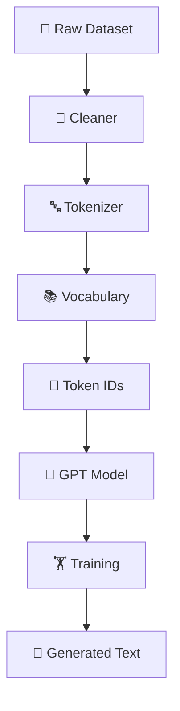
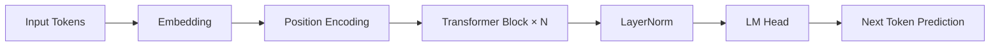

<div align="center">

---

# 📑 Table of Contents

- 🚀 Features
- ⚡ Quick Start
- 🏗️ Architecture
- 📂 Project Structure
- 📚 Tokenizer
- 📦 Dataset Pipeline
- 🤖 GPT Model
- 🏋️ Training
- 🔍 Inference
- 🧪 Testing
- 📊 Progress
- 🗺️ Roadmap
- 🤝 Contributing
- 📜 License

---

# ✨ Features

- ✅ GPT-style Decoder Architecture — built completely from scratch
- ✅ **Modern architecture: RoPE + RMSNorm + SwiGLU + Grouped-Query Attention**
- ✅ **Qwen2.5-compatible** — loads *real pretrained weights* into our own model
- ✅ **Real conversational AI** (`chat_qwen.py`) on the from-scratch architecture
- ✅ Word, Character & Byte-Level BPE Tokenizers (no `<UNK>`)
- ✅ Multi-Head Self Attention + Causal Masking
- ✅ GPT-2 Style Weight Initialization + Weight Tying
- ✅ GPU Training Support (CUDA, fp16 inference)
- ✅ Text Generation (greedy / temperature / top-k / top-p / beam)
- ✅ Interactive Chat (3 modes)
- ✅ Modular Codebase + Unit Tests

---

# 🌟 Highlight — A GPT You Built, Talking Like a Real Assistant

The centerpiece of this project: ARIA-LLM's transformer is **hand-written**
(RoPE, RMSNorm, SwiGLU, GQA — all in `model/`), yet it can load the **real
pretrained weights of Qwen2.5-0.5B-Instruct** and hold a genuine conversation.
Only the *weights* come from Qwen — every line of the forward pass is our code.

```text
you> Hi! My name is Aashutosh.
aira> Hello! Aashutosh. How can I help you today?
you> What is 12 times 8?
aira> 12 times 8 is 96.
you> What was my name?
aira> Your name is Aashutosh.
```

```bash
python scripts/import_qwen.py      # one-time: convert Qwen weights to our format
python chat_qwen.py                # chat on the from-scratch architecture
```

---

# ⚡ Quick Start

```bash
pip install -r requirements.txt
```

**Three ways to chat**, from most to least capable:

```bash
# 1) Real conversation on OUR from-scratch architecture (Qwen2.5 weights)
python scripts/import_qwen.py        # one-time weight conversion (~1 GB download)
python chat_qwen.py

# 2) Real conversation via a pretrained model (simplest)
python chat_ai.py

# 3) The model you train yourself (from scratch, continues text)
python scripts/prepare_data.py
python train.py --data data/tinystories.txt --tokenizer bpe --device cuda \
    --seq-len 128 --output-dir checkpoints_ts
python chat.py --checkpoint checkpoints_ts/best.pt
```

| Mode                                  | Script           | What it shows                          |
| ------------------------------------- | ---------------- | -------------------------------------- |
| **Architecture + real weights** | `chat_qwen.py` | Your transformer, real conversation ⭐ |
| **Pretrained**                  | `chat_ai.py`   | A usable chatbot, minimal code         |
| **From-scratch trained**        | `chat.py`      | The model learning from your data      |

> See **GUIDELINE.md** for full usage details.

---

# 🏗️ Architecture



---

# 🤖 GPT Pipeline



---

# 📂 Project Structure

```text
AIRA-LLM/
├── configs/                # YAML model / training / dataset configs
├── data/                   # corpora (toy, TinyStories, conversations)
├── dataset/                # load → clean → tokenize → sequences
├── tokenizer/              # word / char / byte-level BPE (from scratch)
├── model/                  # the transformer (from scratch)
│   ├── attention.py  multi_head_attention.py  (GQA)
│   ├── rope.py  rmsnorm.py  feed_forward.py    (RoPE, RMSNorm, SwiGLU)
│   ├── transformer_block.py  gpt.py            (Qwen2.5-compatible)
│   └── ...
├── training/               # trainer, loss, optimizer, scheduler, checkpoint
├── inference/              # generator + sampling strategies
├── scripts/
│   ├── import_qwen.py      # convert Qwen2.5 weights → our format
│   └── prepare_data.py     # download the TinyStories corpus
├── tests/                  # assertion-based test suite
├── utils/                  # device, seed, metrics, config loader
├── train.py                # ► train the from-scratch model
├── generate.py             # ► one-off generation
├── chat.py                 # ► chat with the from-scratch model
├── chat_ai.py              # ► chat via a pretrained model
├── chat_qwen.py            # ► chat: our architecture + real Qwen weights ⭐
├── GUIDELINE.md
└── README.md
```

---

# 📚 Tokenizer

| Tokenizer         | Description          |
| ----------------- | -------------------- |
| 🔤 Word           | Word-level tokenizer |
| 🔡 Character      | Character tokenizer  |
| 🧩 Byte-Level BPE | No`<UNK>` token    |

Reserved Tokens:

| Token      | ID |
| ---------- | -: |
| `<PAD>`  |  0 |
| `<UNK>`  |  1 |
| `<BOS>`  |  2 |
| `<EOS>`  |  3 |
| `<MASK>` |  4 |

---

# 📦 Dataset Pipeline

```text
Raw Text
   │
   ▼
Cleaner
   │
   ▼
Tokenizer
   │
   ▼
Vocabulary
   │
   ▼
Token IDs
   │
   ▼
Training Sequences
```

---

# 🧠 GPT Model

Two architecture modes, selectable via config:

**Classic GPT** (for the from-scratch trained model)

- Token Embedding + Sinusoidal Positional Encoding
- Multi-Head Self Attention (causal)
- Feed Forward Network (GELU) + LayerNorm
- Weight Tying + GPT-2 style init

**Modern / Qwen2.5-compatible** (for loading real pretrained weights)

- **RoPE** — Rotary Positional Embeddings (`model/rope.py`)
- **RMSNorm** — Root-Mean-Square normalization (`model/rmsnorm.py`)
- **SwiGLU** — gated feed-forward (`model/feed_forward.py`)
- **GQA** — Grouped-Query Attention (`model/multi_head_attention.py`)

Both share the same `GPT` class — flags like `use_rope`, `use_rmsnorm`,
`use_swiglu`, and `num_kv_heads` switch between them.

---

# 🏋️ Training

- Cross Entropy Loss
- AdamW Optimizer
- Learning Rate Scheduler
- Gradient Clipping
- Checkpointing
- Validation
- GPU Training

---

# 🔍 Inference

- Greedy Decoding
- Temperature Sampling
- Top-k Sampling
- Top-p Sampling
- Beam Search

---

# 🧪 Testing

Run all tests:

```bash
pytest tests -q
```

---

# 📊 Project Status

| Module                           | Status |
| -------------------------------- | ------ |
| 🧠 Model                         | ✅     |
| 🔤 Tokenizer (word / char / BPE) | ✅     |
| 📦 Dataset                       | ✅     |
| 🏋️ Training (GPU)              | ✅     |
| 💬 Chat (3 modes)                | ✅     |
| 🌀 RoPE                          | ✅     |
| 📐 RMSNorm + SwiGLU              | ✅     |
| 🧩 Grouped-Query Attention       | ✅     |
| 🔁 Qwen2.5 weight loading        | ✅     |
| ⚡ Flash Attention               | 🚧     |
| 🗄️ KV Cache                    | 🚧     |
| 📡 API / Web UI                  | 📅     |

---

# 🗺️ Roadmap

## ✅ v0.1

- Core GPT Prototype
- Dataset Pipeline

## ✅ v0.2

- GPT-style Architecture
- Better Attention
- BPE Tokenizer

## ✅ v0.3

- GPU training on real English (TinyStories)
- Modern architecture: RoPE, RMSNorm, SwiGLU, GQA
- Qwen2.5-compatible weight loading → real conversation
- Three chat modes

## 🚧 v0.4

- KV cache + Flash Attention (faster inference)
- Larger from-scratch model
- Instruction fine-tuning

## 🎯 v1.0

- Production Ready AIRA-LLM
- REST API
- Web UI
- Documentation

---

# 🤝 Contributing

1. Fork the repository
2. Create a feature branch
3. Commit your changes
4. Open a Pull Request

---

<div align="center">
