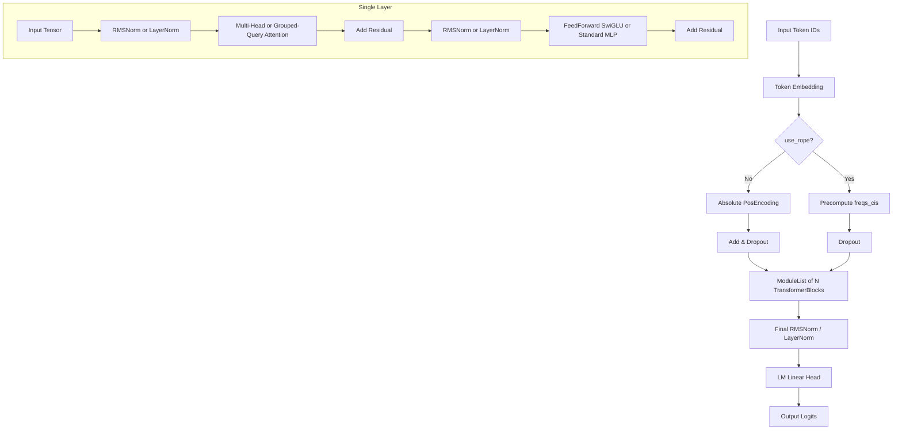

# Architecture Specification

The ARIA-LLM features a modular PyTorch model implementation in `model/`. It supports both classical GPT architectures (absolute positional encodings, LayerNorm, standard GeLU/ReLU) and modern LLM architecture extensions (Rotary Position Embeddings, RMSNorm, SwiGLU FFN, Grouped-Query Attention).

## Architecture Block Diagram

## Technical Component Details

### 1. Embeddings & Positional Encodings (`model/embedding.py`, `model/position.py`, `model/rope.py`)
- **Token Embedding:** Maps token IDs to `embedding_dim` vectors. Weight-tying with the final language model head is supported (and enabled by default).
- **Absolute PosEncoding:** Used if `use_rope=False`. Learns positional parameter weights up to `max_sequence_length`.
- **Rotary Position Embedding (RoPE):** Precomputes complex exponential frequency pairs (`freqs_cis`) and applies them to query and key vectors in the self-attention block during the forward pass.

### 2. Normalization (`model/layer_norm.py`, `model/rmsnorm.py`)
- **LayerNorm:** Standard PyTorch or custom implementation tracking mean and variance.
- **RMSNorm:** Root Mean Square Normalization. More computationally efficient as it skips calculating mean, scaling weights solely on root mean square.

### 3. Attention (`model/multi_head_attention.py`, `model/attention.py`)
- **Multi-Head Attention (MHA):** Parallel queries, keys, and values.
- **Grouped-Query Attention (GQA):** Supports caching and grouping of Key/Value heads (num_kv_heads < num_heads) to reduce memory bandwidth during inference (as implemented in Qwen).
- **Causal Masking:** Standard triangular lower-mask to prevent tokens from attending to future tokens.

### 4. FeedForward (`model/feed_forward.py`, `model/transformer_block.py`)
- **Standard MLP:** Two linear projections with intermediate activation (default GeLU) and dropout.
- **SwiGLU (Swish Gated Linear Unit):** Uses three projections (`w1`, `w2`, `w3`) where Swish activation is applied to `w1(x) * w3(x)` before projecting back with `w2`.
