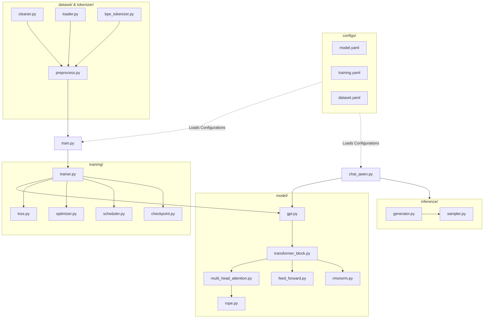

# Dependency Graph

Component and module relationship maps.

## Component Flow Overview

## Description of Interactions
1. **Configuration Loader:** `utils/helper.py` reads YAML config files to set parameters for `GPT` class initialization and `Trainer` training constraints.
2. **Preprocessing Pipeline:** `dataset/preprocess.py` combines text cleaner (`dataset/cleaner.py`) and vocab tokenizers (`tokenizer/bpe_tokenizer.py`) to prepare dataset loader sequences.
3. **Training Execution:** `train.py` loads raw text datasets, configures the `GPT` model, and boots `Trainer` to run gradients minimization loops.
4. **Interactive Chat:** `chat_qwen.py` loads Qwen2.5 weights, passes user queries to `GPT.forward()` through the `inference/generator.py` autoregressive generator, streaming decoded tokens back.
