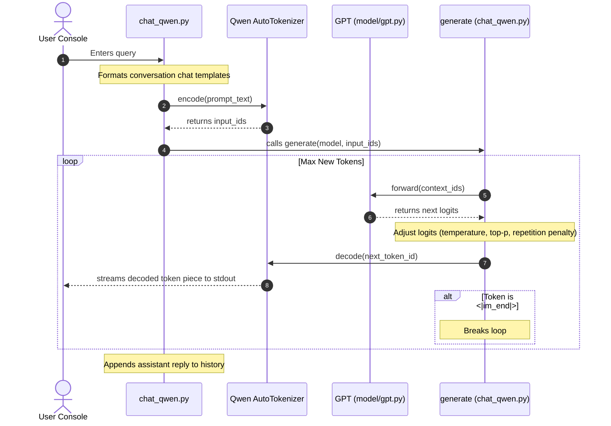
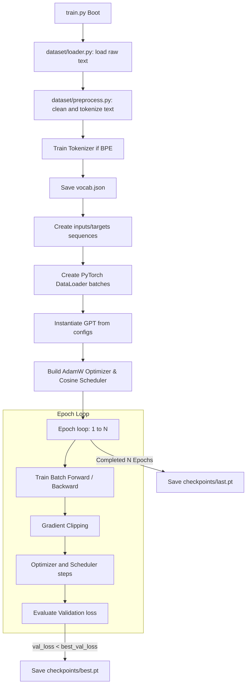

# Event Graph

Events and operational flows in ARIA-LLM.

## Interactive Chat Event Loop (`chat_qwen.py`)

This graph maps the event flow for a single user query execution in `chat_qwen.py`:

## Dataset Training Cycle (`train.py`)

This graph maps the event flow of training:

