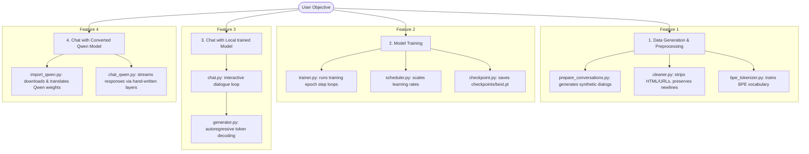

# Feature Map

The core user features provided by ARIA-LLM.

## Feature Overview

## Features Details

### 1. Preprocessing & Custom Tokenization
- **Cleaner Pipeline:** Clean raw text with custom regulations. Specifically ignores newline removals when in conversational training mode.
- **Custom BPE Tokenizer:** Learns BPE merges from raw text corpora and translates strings to integer token lists.

### 2. PyTorch Training Loop
- **AdamW Optimization:** Standard training optimization.
- **Cosine Warmup:** Linear learning rate warmup followed by a cosine decay cycle.
- **Gradient Clipping:** Prevents exploding gradients during training.

### 3. Advanced Sampling Inference
- **Autoregressive Decoding:** Generates tokens step-by-step.
- **Nucleus (Top-p) & Top-k Sampling:** Prunes low probability outputs to balance vocabulary creativity and coherence.
- **Temperature Scaling:** Standard scaling for logits.
- **Repetition Penalty:** Penalizes already produced tokens to avoid generation loops.

### 4. Qwen-2.5 Weight Importer
- **State Dictionary Mapping:** Maps Hugging Face's Qwen2.5 weights schema to our custom handwritten transformer blocks.
- **Grouped-Query Attention Support:** Handles caching and RoPE transformations.
