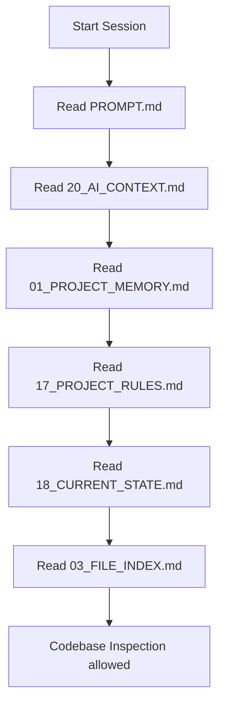

# Agent Boot Sequence

Every incoming AI agent opening this repository must follow this boot procedure exactly.

## Step-by-Step Executable Directives

1. **Step 1: Check VERSION.json**
   - View [VERSION.json](file:///d:/Personal%20Project/ARIA-LLM/brain/VERSION.json) to check if the Brain status is `Healthy`. If the status is `Needs Update`, look at `stale_documents` to identify what needs immediate synchronization.
2. **Step 2: Read Guidelines & Context**
   - Read the global rules in [PROMPT.md](file:///d:/Personal%20Project/ARIA-LLM/brain/PROMPT.md) and [17_PROJECT_RULES.md](file:///d:/Personal%20Project/ARIA-LLM/brain/17_PROJECT_RULES.md).
3. **Step 3: Resolve file paths via File Index**
   - Prior to opening any files in the codebase, consult [03_FILE_INDEX.md](file:///d:/Personal%20Project/ARIA-LLM/brain/03_FILE_INDEX.md) to locate the exact module files related to your task.
4. **Step 4: Execute Minimum-Scanning Changes**
   - Open only the resolved files. Do not scan the entire directory.
   - Implement your changes, keeping coding and architecture rules in mind.
5. **Step 5: Perform Synchronization**
   - Update `brain/VERSION.json` with the modified files list, documentation version increment, and new hashes.
   - Synchronize any modified components in the affected documentation files.
